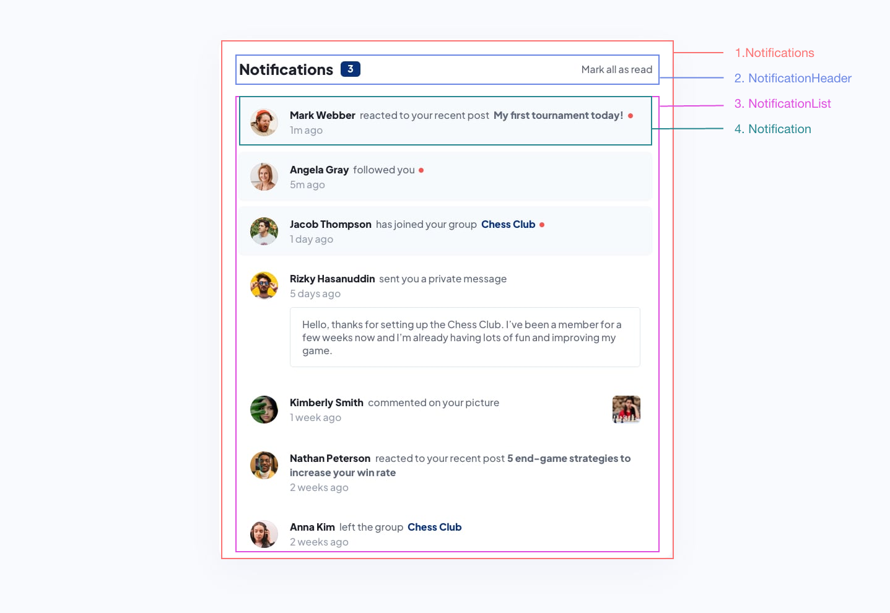

STEPS TO FOLLOW.

Step 1: Break the UI into a component hierarchy
Step 2: Build a static version in React
Step 3: Find the minimal but complete representation of UI state
Step 4: Identify where your state should live
Step 5: Add inverse data flow

### Step 1: Break the UI into a component hierarchy

Do a CSS Reset

Breakdown: ✅

Components Hierarchy: ✅

•Notifications >
•NotificationHeader
•NotificationList >
•Notification

### Step 2: Build a static version in React

- Build the html structure and create component files. ✅
- Build the header and its css (create class names etc.) use Flex ✅
- Add css to the notifications (container - like bg, box-shadow, max-width, paddings. etc) ✅
- Add avatar images path to the data.json ✅
- Build notification container and its css (ul) ✅
- Build static version of an individual notification item (li) with its css  
  (Display avatar and the message - build one notification first and render the same item few times for now) with Flexbox ✅

### Step 3: Find the minimal but complete representation of UI state

Decide and list the states (read/unread) and different data types (comment, follow etc.) to be rendered.

### Step 4: Identify where your state should live

-

### Step 5: Add inverse data flow

- Update the state of notifications onClick (Mark as read and on notification item itself)
